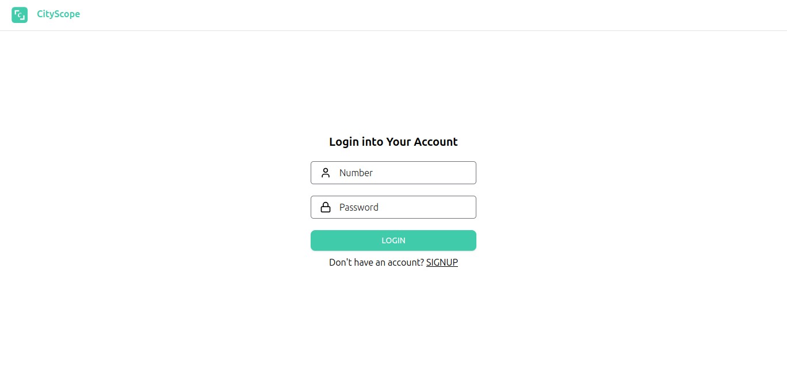
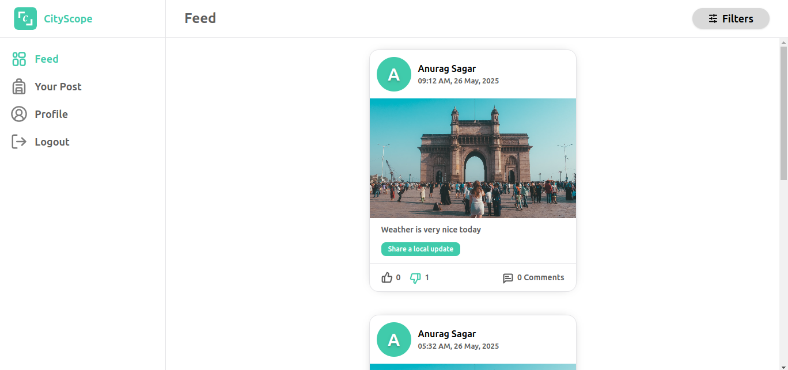
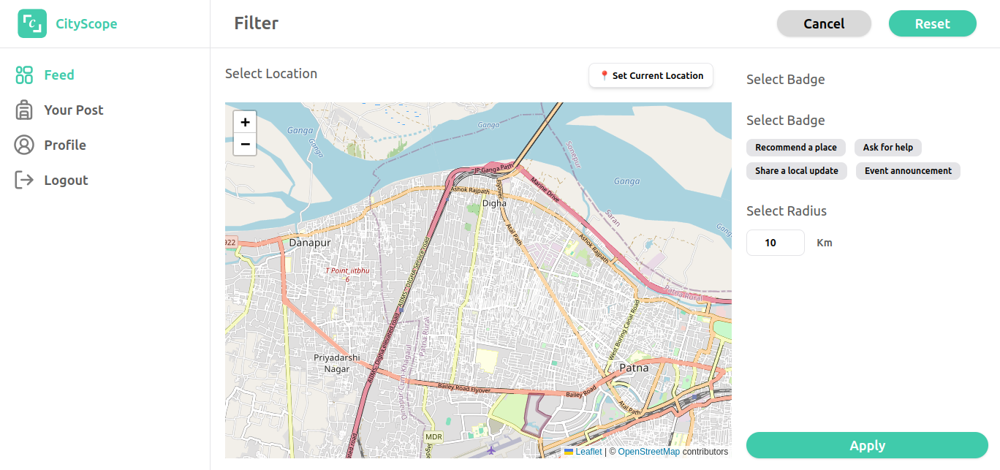
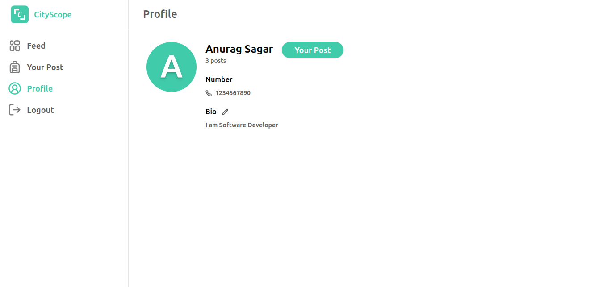
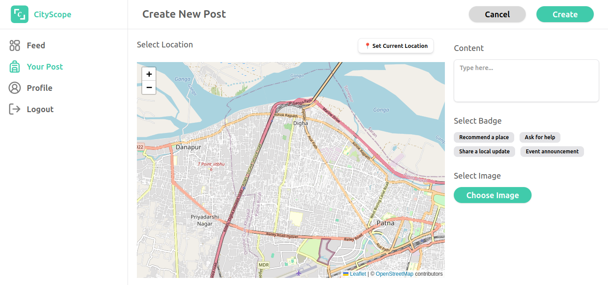

# Cityscope

## About
This project is a full-stack location-based community platform built for the Cityscope assignment. The app features user authentication, image uploads, location-based filtering, likes , comments and a clean, responsive UI built.

## Table of Contents
- [Built using](#built-using)
- [How to run project](#how-to-run-project)
- [Current Demo](#current-demo)

### Built using

* **Backend**
    - Typescript
    - Express
    - Mongodb
    - Mongoose Library
    - JWT
    - Bcrypt
    - Turborepo
    - AWS S3 (Image) 


* **Frontend Web**
    - Typescript
    - React
    - Tailwind
    - Shadcn
    - Axios
    - Redux
    - React Hook Form
    - Leaflet

### How to run project
- Node js must be installed
- Clone the project with
```
https://github.com/AnuragDevMastermind/cityscope-assignment.git
```
- Navigate to the directory
```
cd Cityscope
```
- Install the dependencies with
```
npm i
```
- run with
```
npm run dev
```
- Wait for this log to come after that run the frontend
```
Server is running at http://localhost:8081
```

### Current Demo




